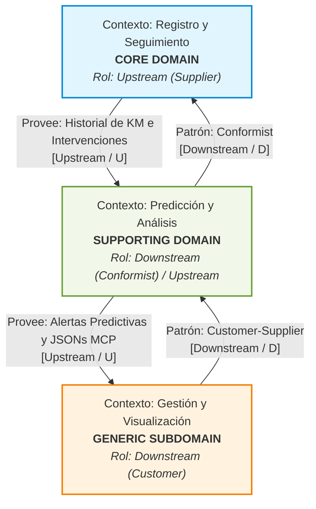

# Mapa de Contextos (DDD)

```mermaid
graph TD
    %% Estilos Avanzados
    classDef core fill:#e1f5fe,stroke:#0288d1,stroke-width:2px;
    classDef support fill:#f1f8e9,stroke:#689f38,stroke-width:2px;
    classDef generic fill:#fff3e0,stroke:#f57c00,stroke-width:2px;

    %% Contextos
    BC1["Contexto: Registro y Seguimiento<br><b>CORE DOMAIN</b><br><i>Rol: Upstream (Supplier)</i>"]:::core
    BC2["Contexto: Predicción y Análisis<br><b>SUPPORTING DOMAIN</b><br><i>Rol: Downstream (Conformist) / Upstream</i>"]:::support
    BC3["Contexto: Gestión y Visualización<br><b>GENERIC SUBDOMAIN</b><br><i>Rol: Downstream (Customer)</i>"]:::generic

    %% Conexiones con etiquetas formales de DDD
    BC1 -- "Provee: Historial de KM e Intervenciones<br>[Upstream / U]" --> BC2
    BC2 -- "Patrón: Conformist<br>[Downstream / D]" --> BC1
    
    BC2 -- "Provee: Alertas Predictivas y JSONs MCP<br>[Upstream / U]" --> BC3
    BC3 -- "Patrón: Customer-Supplier<br>[Downstream / D]" --> BC2
```
